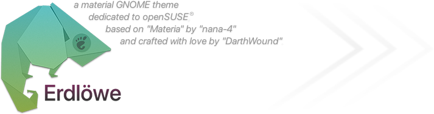

#
`VERSION 1.0-20180131 (X.X = Erdlöwe version - YYYYMMDD = Materia master build)`

[Overview](#overview) - [Requirements](#requirements) - [Installation](#installation) - [Suggestions](#suggestions) - [Extras](#extras) - [Screenshots](#screenshots) - [Credits](#credits) - [FAQ](#faq)
#
#

## Overview

*`open image in new tab to see it fullsize and sharp`*

**Changes from Materia:**
  - Adobe "Source Sans Pro" fonts instead of Mplus and Roboto
  - Color scheme inspired by new openSUSE® branding and websites

**Supported desktops:** GNOME *(≤ 3.26)* only.
  - *Other GTK3/GTK2 desktops like Xfce *may* have weird issues as I didn't focus on them.*
  
**Variations:**

| **Erdlöwe** | **-** | **compact** |
|:-:|:-:|:-:|
| **-** |  |  |
| **light** |  |  |
| **dark** |  |  |
#
#
## Requirements

- **GTK+** *(>=3.18, should be already installed)*

- **Adwaita** *(default GNOME theme, should be already installed)*

- **Murrine engine**
  - `sudo zypper in gtk2-engine-murrine` to install in openSUSE®

- **Source Sans fonts**
  - `sudo zypper in adobe-source*pro-fonts` to install in openSUSE®
  
- **GNOME Tweaks tool** & "User themes" extension *(could be already installed)*
#
#
## Installation

/!\ Please check requirements before anything.

**First install**

Copy/paste this in user terminal and follow instructions:

`wget -qO- https://raw.githubusercontent.com/DarthWound/erdlowe-theme/master/install.sh | sh`

Or go in [releases tab](https://github.com/DarthWound/erdlowe-theme/releases), download and extract archive, then put content in your themes directory *('~/.themes' or '/usr/share/themes')*.

**Later updates**

Copy/paste this in user terminal and follow instructions:

`wget -qO- https://raw.githubusercontent.com/DarthWound/erdlowe-theme/master/update.sh | sh`

Or go in [releases tab](https://github.com/DarthWound/erdlowe-theme/releases), download and extract archive, then put content in your themes directory *('~/.themes' or '/usr/share/themes')*.
#
#
## Suggestions

- **Fonts:**
  - Window titles: Source Sans Pro bold 10
  - Interface: Source Sans Pro regular 12
  - Documents: Source Serif Pro regular 12
  - Monospace: Source Code Pro regular 12

- **Icons:**
  - [Papirus](https://github.com/PapirusDevelopmentTeam/papirus-icon-theme) with [grey folders](https://github.com/PapirusDevelopmentTeam/papirus-folders)

- **Extensions:**
  - [Argos-DWS](https://github.com/DarthWound/Argos-DWS)
  - [Darker Overview](https://extensions.gnome.org/extension/1177/darker-overview/)
  - [Remove Arrows](https://extensions.gnome.org/extension/800/remove-dropdown-arrows/)
  - [Overlay Icons](https://extensions.gnome.org/extension/302/windowoverlay-icons/)
  - [Notifications Alerts](https://extensions.gnome.org/extension/258/notifications-alert-on-user-menu/)
  - [Appfolders Manager](https://extensions.gnome.org/extension/1217/appfolders-manager/)
#
#
## Extras

**GNOME Terminal scheme:** *([screenshot](extras/erdlowe-terminal-screenshot.png?raw=true))*

`wget -qO- https://raw.githubusercontent.com/DarthWound/erdlowe-theme/master/extras/erdlowe-terminal.sh | sh`
  
**Gedit color scheme:** *([screenshot](extras/erdlowe-gedit-screenshot.png?raw=true))*

`sudo wget -P /usr/share/gtksourceview-3.0/styles https://raw.githubusercontent.com/DarthWound/erdlowe-theme/master/extras/erdlowe-gedit.xml`
#
#
## Screenshots

**Standard variant + compact for shell:**

*`open image in new tab to see it fullsize and sharp`*

**Light variant + compact for shell:**

*`open image in new tab to see it fullsize and sharp`*

**Dark variant + compact for shell:**

*`open image in new tab to see it fullsize and sharp`*
#
#
## Credits

- **Based on** [Materia](https://github.com/nana-4/materia-theme) by [nana-4](https://github.com/nana-4). Thank you so much for your impressive work and your kindness.

- **Designed with** [openSUSE](https://www.opensuse.org/)® color palette for themes and [SUSE](https://www.suse.com/)® color palette for Terminal/Gedit schemes.
  - *openSUSE® branding guidelines -> [here](https://opensuse.github.io/branding-guidelines/)*
  - *SUSE® branding guidelines -> [here](https://www.suse.com/brandcentral/suse/identity.php)*
#
#
## FAQ

- **How to report issues?**
  - Post something in [issues tab](https://github.com/DarthWound/erdlowe-theme/issues). Issues strictly regarding Materia must be reported on [it's own page](https://github.com/nana-4/materia-theme/issues).

- **How to contribute?**
  - I usually don't accept pull requests, but I accept contributions that I inject later. Of course you're credited.

- **Why not include other desktops?**
  - It requires a lot of work and I don't have that much spare time. Maybe later :-)

- **Why not use -*insert famous theme*- as a base?**
  - Materia is perfectly tuned and keeps improving.
  - Adwaita is too hard to tweak deeply, Arc already has [Geeko](https://github.com/LelCP/geeko-gtk-theme), and Adapta is based on Materia so...

- **"Erdlöwe"? What does that mean?**
  - It's a german word for chameleon, which is the mascot of openSUSE®/SUSE®. It means "grounded lion".
  - I don't use the "ö" with umlaut in files/scripts because I want to avoid issues with any encoding.

- **Did you draw this logo yourself?**
  - Yes, in my opinion it fits "MaterialDesign+openSUSE®" idea perfectly.
  - Inspiration came from this origami chameleon [picture](https://www.flickr.com/photos/66767942@N04/14171125448).
